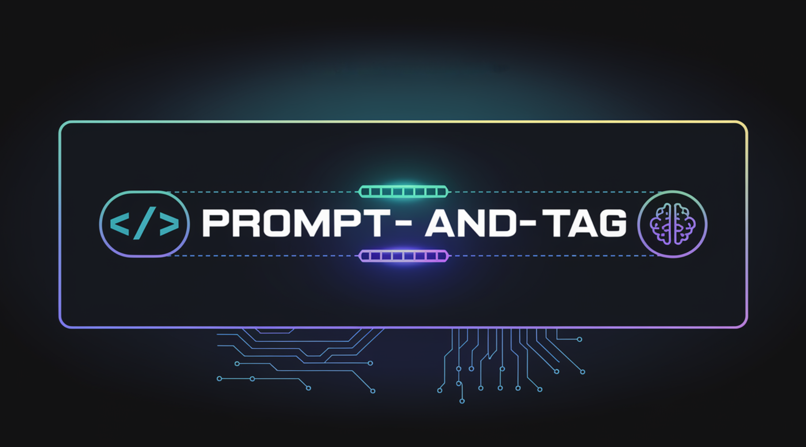

#  Jarad DeLorenzo
## 👨‍💻 Staff Engineer | 🚀 Tech Innovator | 🤖 AI Enthusiast

<!-- {:.section-transition} -->
### 🌟 About Me

I'm a Staff Engineer with 20+ years of experience driving technical excellence and delivering high-impact solutions. Currently spearheading AI developer workflow tools, integrations and microservices architecture @[Justworks](https://justworks.com) in downtown NYC.

- 🏗️ Expert in Software Architecture & System Design
- 🌐 Microservices & Distributed Systems
- ☁️ Cloud Platforms guru (AWS, Google Cloud)
- 🤖 AI and Agentic workflows strategist
- 👥 Passionate about Technical Leadership & Mentoring

<!-- {:.section-transition} -->
### 🛠️ Tech Stack

<!-- {:.section-transition} -->
### 🚀 Career Highlights

<!-- {:.grid.grid-cols-1.md:grid-cols-2.gap-6} -->

<!-- {:.bg-gray-100.dark:bg-gray-800.p-4.rounded-lg} -->

- Architected multiple microservices in the Workforce Management and Time & Attendance space
- Spearheaded the development of AI-powered developer workflows and integrations

<!-- {:.bg-gray-100.dark:bg-gray-800.p-4.rounded-lg} -->

- Led successful transition to microservices architecture

<!-- {:.bg-gray-100.dark:bg-gray-800.p-4.rounded-lg} -->

- Built and led a team that managed to launch and grow ClassPass to a billion-dollar valuation

<!-- {:.bg-gray-100.dark:bg-gray-800.p-4.rounded-lg} -->

- Pioneered Computer Vision initiatives for virtual try-on experiences and AI-powered biometric analysis

<!-- {:.section-transition} -->
### 📚 Education

- 🎓 M.S. Software Engineering, Stevens Institute of Technology
- 🎓 B.S. Computer Science & B.S. Mathematics, Drexel University

<!-- {:.section-transition} -->
### 🌟 Open Source Projects

<!-- {:.grid.grid-cols-1.md:grid-cols-2.gap-6} -->

<!-- {:.bg-white.dark:bg-gray-800.rounded-lg.shadow-md.overflow-hidden} -->

#### DidStuff

A CLI tool that adds AI-generated commit messages to your git repositories.

[View on GitHub](https://github.com/delorenj/did-stuff)

<!-- {:.bg-white.dark:bg-gray-800.rounded-lg.shadow-md.overflow-hidden} -->

#### Prompt & Tag

Easily version, tag, and share your context windows across LLM providers.

[View on GitHub](https://github.com/delorenj/prompt-and-tag)

<!-- {:.section-transition} -->
### 🤝 Let's Connect!

Always eager to discuss the latest in tech, AI integration, or your engineering challenges. Feel free to reach out!

---

⭐️ From [Jarad DeLorenzo](https://github.com/delorenj)